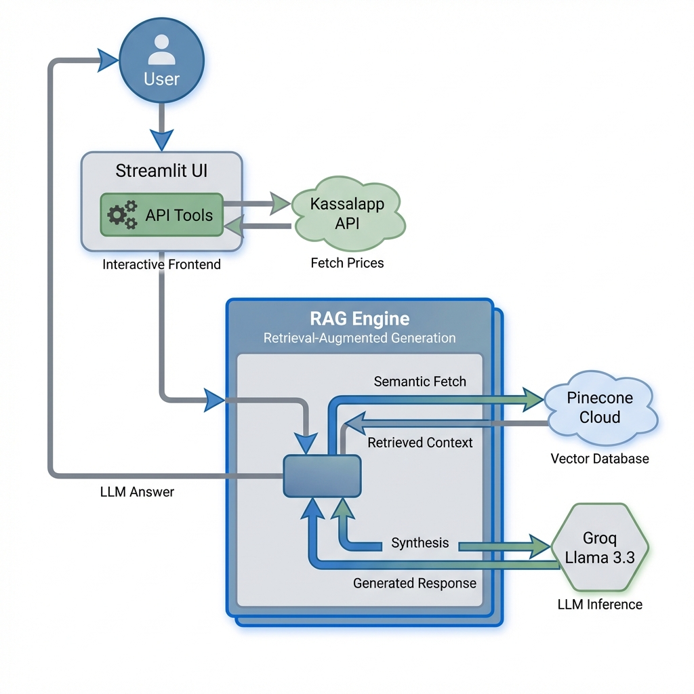

<!--
---
title: Kassalapp Assistant
emoji: 🛒
colorFrom: green
colorTo: blue
sdk: streamlit
sdk_version: 1.52.2
app_file: app.py
pinned: false
---
-->

# Kassalapp Assistant - RAG-Powered Grocery Shopping Helper

> [!TIP]
> **🚀 Try it Live**: Click the **Hugging Face** button above to launch the application!
> *Please note: If the Space is sleeping, it may take up to **30 seconds** to start.*

**An intelligent, Norwegian grocery shopping assistant built with Groq (Llama 3.3) and the [Kassalapp API](https://kassal.app/api/), designed for deployment on Hugging Face Spaces.**

---

## ✨ Key Features

*   🌍 **Cloud-Hybrid RAG**: Combines static domain expert knowledge with live market data for accurate shopping assistance.
*   🧠 **Extensible Knowledge Base**: Easily add your own data (loyalty programs, store guides) by dropping files in a folder.
*   ⚡ **Inference Engine**: Powered by **Groq & Llama 3.3** for responsive conversational AI.
*   🛠️ **Real-Time Data**: Dynamic tool calling to the **Kassalapp API** for live grocery price, product, and store information.
*   🛡️ **Universal Secrets**: Seamless transition between local `.env` and cloud `st.secrets` environments.

---

## 💡 Motivation & Inspiration

I built this project to get a **general understanding** of how to develop **RAG (Retrieval-Augmented Generation)** systems and the tools that exist for it. 

The spark for using the Kassalapp API came from a [2023 Kode24 article](https://www.kode24.no/artikkel/helge-lager-prisjakt-for-mat-hittil-har-jeg-tjent-400-kroner/170061) about Helge, who built a price tracker for groceries. I thought it was a very cool project, and I’d always wanted to make something with that API. 

When I started learning about RAG and LLMs, I realized this was the perfect opportunity to **"kill two birds with one stone"**. While this solution is not perfect, it works for most cases. It is also worth noting that **AI has been used as a tool** in the development of this project.

### ⚠️ Current Status & Limitations
This is an educational project. While it covers the essentials, you may encounter some limitations:
*   **Prompt Sensitivity**: Tricky or advanced prompts might occasionally result in sub-optimal answers.
*   **Data Availability**: The underlying API is relatively simple, and many grocery products are missing price data or specific store information.
*   **Expansion Potential**: There are many more things that can be done to improve the system, such as fetching more data from the API or expanding the knowledge base further.

---

## 🧠 Architecture: Understanding "Hybrid RAG"

This project uses a **Hybrid RAG** (Retrieval-Augmented Generation) architecture. It merges two distinct types of data:

1.  **The "Static" Semantic Layer (Pinecone Cloud)**:
    *   **What it is**: Expert domain knowledge that doesn't change every second (e.g., How the "Trumf" program works, return policies, or store chain history).
    *   **Why we need it**: By storing these as vectors in Pinecone, the AI can "read" the official guides before answering.
    *   **How to add to it**: Place any `.md` or `.txt` file into the `knowledge/` directory and run the sync script.

2.  **The "Dynamic" Tool Layer (Kassalapp API)**:
    *   **What it is**: Real-time market data (e.g., The current price of a loaf of bread).
    *   **Why we need it**: Even a 5-minute-old database is "stale" for prices. The AI uses **Function Calling** to fetch live data directly from the Kassalapp API.

### Synchronizing your Knowledge
The `sync_to_pinecone.py` utility handles the process of breaking your knowledge files into chunks, turning them into mathematical vectors (embeddings), and uploading them to your cloud database. This ensures your AI stays updated with your custom documentation.

---

## 🛠️ Tech Stack

*   **Frontend**: [Streamlit](https://streamlit.io/)
*   **Hosting**: [Hugging Face Spaces](https://huggingface.co/spaces) or [Streamlit Cloud](https://share.streamlit.io/)
*   **LLM Inference**: [Groq](https://groq.com/) (Llama 3.3 70B)
*   **Vector Store**: [Pinecone Cloud](https://pinecone.io/)
*   **Embeddings**: `all-MiniLM-L6-v2`
*   **Data Source**: [Kassalapp API](https://kassal.app/)

---

## 🚀 Getting Started

To get the assistant up and running locally or in the cloud:

1.  Refer to the [**Deployment Guide**](DEPLOYMENT.md) for step-by-step instructions.
2.  Set up your environment variables via `.env` (local) or Secrets (Cloud).
3.  Ensure your data is synced using `sync_to_pinecone.py`.

---

Built with ❤️ using **Groq**, **Pinecone**, **Hugging Face**, **Streamlit**, and **Kassalapp**.
